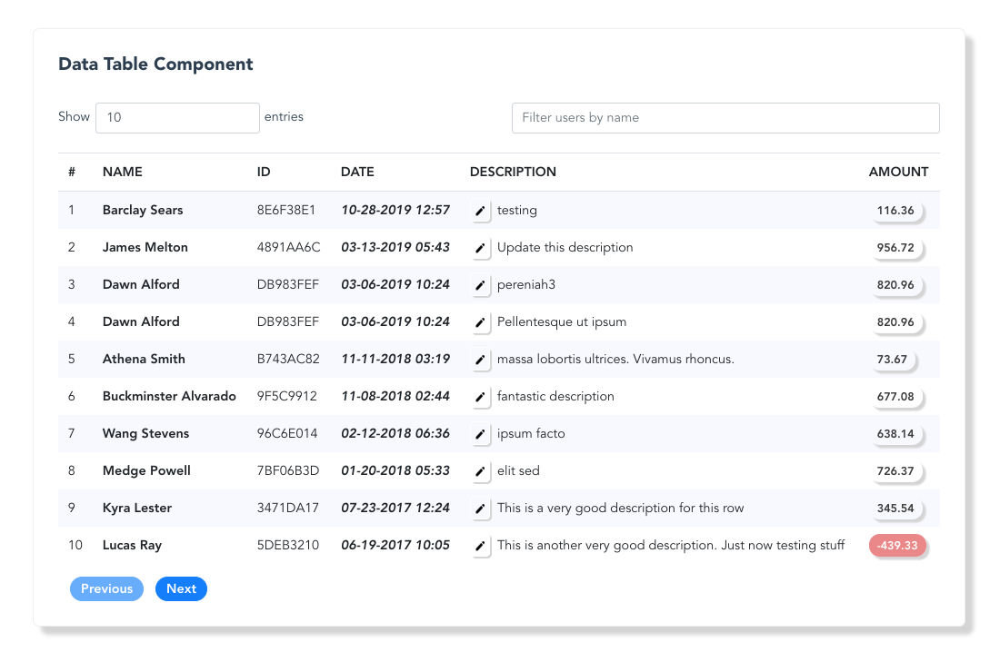

# datatable-component

#### Development Time: 15hours

This repository houses code for a custom datatable component built in VueJS. The custom component has as its features:
* Searching
* Filtering
* Displaying data in sorted columns(_according to date_)
* Effective display and user experience across resolutions

The User stories include: 
* As a payment supervisor, I would like to be able to view recent payments logged in the system, so that I can understand all the transactions that have been made.

* As a payment supervisor, I would like to be able to edit the descriptions of recent payments easily, so that others can clearly understand why a payment was made.

### Demo
A demo of the project can be found: [here](https://v-datatable.herokuapp.com/)


### Project setup and running
* Clone project: `git clone https://github.com/DanCarl857/data-table-vue.git` or you could just download it.
* cd example
* npm install
* npm run serve
* navigate to `http://localhost:8080` in the browser

#### Usage
```js
import DataTable from './components/DataTable';
export default {
    name: 'app',
    components: {
        // other components ...
        'v-datatable': DataTable
    },
    // ...
  }
```

In template: 
```js
<v-datatable 
    :columns="['name', 'ID', 'date', 'description', 'amount']"
    title="Data Table Component"
    :dtData="allEntries"
    :count="entriesCount"
/>
```

where: 
* columns: represents the table headers _type: String_
* title: displays a title at the top of the table _type: String_
* dtData: the data to be displayed _type: Array_
* count: the length of the *dtData* array _type: Number_


#### Some questions
```
In what ways would you adapt this component so that it could be used in many different scenarios
```
* Make it as generic as possible so that everything including styling can be provided by the user, of course the default styling will be available
* Make the component an *npm package* so it can be installed using tools like npm and yarn

```
What CSS property did you recently learn about that helped you on a project
```
* In general I learned about the [BEM](https://en.bem.info/methodology/) which helped me better structure my CSS

```
What is your favorite modern Javascript feature? Why?
```
* Arrow functions. This allow for cleaner functions.
* In terms of framework specifics, *Hooks*, I know this feature is not exactly full production yet in VueJS, but in ReactJS, I just can't get enough of it. Hooks allow for better written components with smaller footprints.

```
What is your favorite modern Javascript feature? Why?
```
* Vuetify. Lets me build vuejs applications very fast. Very good tool for prototyping, demonstrations and yes for production code too.

```
Would you do everything differently if you had more time?
```
* Make current styling default and allow for more styling to be passing to the component
* Improve testing, didn't really do a good job due to time limit I gave myself for this.
* Fix column sorting logic
* Make component installable using tools like NPM and Yarn.
* Setup CI/CD so that changes are automatically deployed to the hosted example

### Docker 
* Assuming you have docker installed,
* Build an image using: `docker build -t vuejs-component/v-datable .`
* Run application in container: `docker run -it -p 8080:8080 --rm --name v-datable1 vuejs-component/v-datable`

### Compiles and hot-reloads for development
```
npm run serve
```

### Compiles and minifies for production
```
npm run build
```

### Run your tests
```
npm run test
```

### Lints and fixes files
```
npm run lint
```

The technologies used in this project involve but are not limited to:
* VueJS
* Vuex
* Firebase
* MomentJS
* Docker
* Heroku(_for deployment_)

### Contributors
* [Daniel Carlson](https://github.com/DanCarl857)

